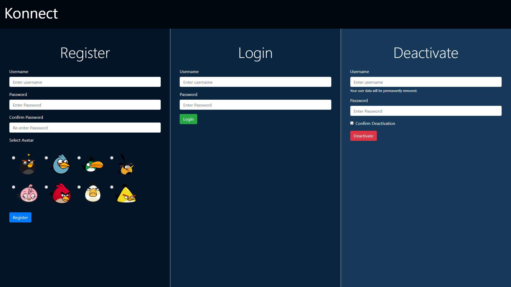
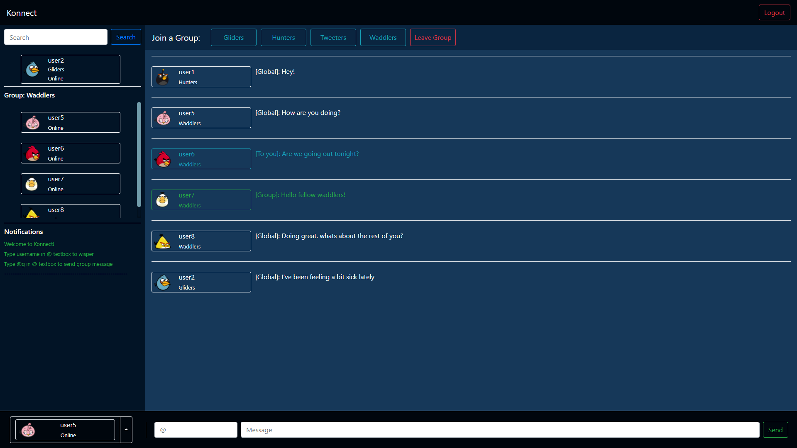

# Konnect - Messaging app

Konnect is messaging app hosted over local server. 

## Quick Start
```bash
#Install dependencies
$npm install

#Start local server at localhost:3000
$npm start

#Visit http://localhost:3000/Konnect/
```

## Features

- Enter the chatroom with a suitable username and avatar.
- You can join one of the four available groups and make friends. Your and find all your online groupmates on the group tab.
- You can send global, group or direct messages while chatting.
- Change your 'Online' status to 'Away' or 'Busy' to let others know.

### About the project

The entire project is made using HTML, CSS and node.JS with the following dependencies: 
- Bootstrap
- jQuery
- Socket.io
- ExpressJS
---

### Screenshots

>Homepage



>Chatroom

